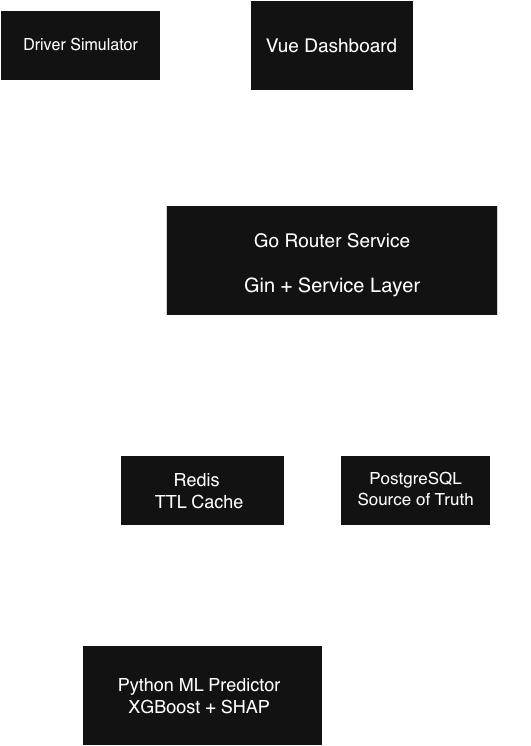

# OptiRoute — Real-Time Fleet Monitoring & Demand Prediction

OptiRoute is a real-time fleet monitoring and demand prediction system built to explore how delivery platforms can track active drivers and forecast demand across different city zones.

The project combines a Go backend, Redis caching, PostgreSQL persistence, a Python-based XGBoost predictor, and a Vue dashboard to visualize live driver locations and demand predictions.

**Tech Stack**: Go · Python · Vue 3 · XGBoost · Redis · PostgreSQL · Leaflet · FastAPI · Gin

---

## Project Overview

**OptiRoute** focuses on two main problems:

1. Tracking active drivers in real time.
2. Predicting short-term demand in different city zones.

The system stores live driver state in Redis for fast access, persists historical data in PostgreSQL, and uses an XGBoost model to estimate future demand based on zone and time-based features.

### Key Components

| Component | Tech | Port | Purpose |
|-----------|------|------|---------|
| **Router** | Go + Gin | 8080 | API for driver updates, active drivers, orders; Routes to Redis/Postgres |
| **Predictor** | FastAPI + XGBoost | 8000 | ML demand forecasting; Subscribes to driver updates via Redis pub/sub |
| **Dashboard** | Vue 3 + Leaflet | 5173 | Real-time map visualization; Shows predictions & driver locations |
| **Redis** | Cache + Pub/Sub | 6379 | Live driver state (TTL=60s), event notifications |
| **PostgreSQL** | Persistent DB | 5432 | History of driver updates & orders |

### Data Flow

```
Driver Update:
  Driver Simulator
    ↓ PUT /api/v1/drivers/location
  Router (Go)
    ├→ Redis SET (TTL 60s)
    ├→ Postgres INSERT
    └→ Redis PUBLISH (driver:updates)
      
 
  Dashboard
    ↓ GET /drivers/active
  Router
    ↓
  Redis
    ↓
  Returns active drivers

Demand Prediction:
  Dashboard
    ↓ POST /api/v1/predict_demand
  Predictor (XGBoost + SHAP)
    ↓
  Dashboard
    → displays zone demand bubbles
```

---

## Architecture



The Go router handles driver updates and order management. Redis stores live driver state and publishes driver update events. PostgreSQL stores historical records. A Python FastAPI service subscribes to driver events and serves demand predictions generated using an XGBoost model. The Vue dashboard visualizes active drivers and predicted demand across zones.

---

## API Endpoints

### Router (Go) — http://localhost:8080

#### Driver Location
```bash
# Update a driver's location
curl -X PUT http://localhost:8080/api/v1/drivers/location \
  -H "Content-Type: application/json" \
  -d '{
    "driver_id": "driver_001",
    "latitude": 12.9352,
    "longitude": 77.6245
  }'

# Get all active drivers (from Redis cache)
curl http://localhost:8080/api/v1/drivers/active
```

#### Orders
```bash
# Create an order
curl -X POST http://localhost:8080/api/v1/orders \
  -H "Content-Type: application/json" \
  -d '{
    "customer_id": "cust_123",
    "latitude": 12.9500,
    "longitude": 77.6300
  }'

# Get pending orders in a zone
curl http://localhost:8080/api/v1/orders/zone/zone_northeast
```

#### Health & Metrics
```bash
curl http://localhost:8080/health
curl http://localhost:8080/metrics  # Prometheus format
```

### Predictor (Python) — http://localhost:8000

```bash
# Predict demand for a zone
curl -X POST http://localhost:8000/api/v1/predict_demand \
  -H "Content-Type: application/json" \
  -d '{
    "zone_id": "koramangala",
    "hour_of_day": 14,
    "day_of_week": 3,
    "is_raining": false,
    "current_orders": 10
  }'

# Response example:
# {
#   "zone_id": "koramangala",
#   "predicted_orders": 18.45,
#   "model_version": "xgboost-v1",
#   "top_factors": [
#     {"feature": "hour_of_day", "contribution": 2.345},
#     {"feature": "is_lunch_hour", "contribution": 1.892},
#     {"feature": "base_zone_demand", "contribution": 0.756}
#   ]
# }
```

---

## Running Locally (Without Docker)

### Prerequisites per Service
- **Router**: Go 1.20+
- **Predictor**: Python 3.9+
- **Dashboard**: Node 20+
- **Redis**: Redis 6+
- **Postgres**: PostgreSQL 13+

### Router (Go)
```bash
cd router
go mod download
go run cmd/server/main.go
```

### Predictor (Python)
```bash
cd predictor
pip install -r requirements.txt
uvicorn app.main:app --reload --port 8000
```

### Dashboard (Vue)
```bash
cd dashboard
npm install
npm run dev
```

### Start Redis & Postgres (if not Docker)
```bash
# Redis
redis-server

# Postgres (assumes installed locally)
# Create database: createdb -U postgres optiroute
```

## Running With Docker

### Build and Start All Services

```bash
docker compose up --build
```

This starts:

- Router (Go) → http://localhost:8080
- Predictor (FastAPI) → http://localhost:8000
- Dashboard (Vue) → http://localhost:5173
- Redis → localhost:6379
- PostgreSQL → localhost:5432

### Stop Services

```bash
docker compose down
```

---

## Project Structure

```
optiroute/
├─ router/                     # Go backend (Gin, GORM, metrics)
│  ├─ cmd/server/main.go
│  ├─ internal/
│  │  ├─ handlers/
│  │  ├─ services/
│  │  ├─ models/
│  │  └─ config/
│  ├─ Dockerfile
│  └─ go.mod
│  └─ Dockerfile
│
├─ predictor/                  # Python backend (FastAPI, XGBoost, SHAP)
│  ├─ app/
│  │  ├─ main.py
│  │  ├─ subscriber.py
│  │  └─ routers/predict.py
│  ├─ models/
│  │  ├─ xgboost_demand_model.pkl
│  │  └─ label_encoder.pkl
│  ├─ requirements.txt
│  └─ Dockerfile
│  └─ Dockerfile
│
├─ dashboard/                  # Vue 3 frontend (Leaflet, Vite)
│  ├─ src/App.vue
│  ├─ package.json
│  └─ Dockerfile
│  └─ Dockerfile
│
├─ docs/
│  └─ system-diagram.png
│
├─ docker-compose.yml
├─ .env.example
└─ README.md
```

---


## Design Decisions & Trade-offs

1. **Multi-service Architecture**: Separation of concerns (router, predictor, frontend); scales independently.
2. **Redis + Postgres Trade-off**: Redis for speed + TTL + pub/sub; Postgres for durability + history.
3. **Circuit Breaker Pattern**: Graceful degradation — if Redis fails, system still works via Postgres fallback.
4. **ML Explainability**: SHAP shows which features influenced predictions (interpretability).
5. **Resilience**: TTL-based cleanup, conditional DB updates, failure mode handling.
6. **Scaling**: The current design keeps services independent, making it easier to scale the router and predictor separately in the future.

---

## Future Improvements

- Dockerized deployment using Docker Compose
- AWS deployment (EC2)
- Swagger/OpenAPI documentation
- Real-time dashboard updates using WebSockets
- Better demand prediction using real-world datasets
- Authentication and role-based access control
